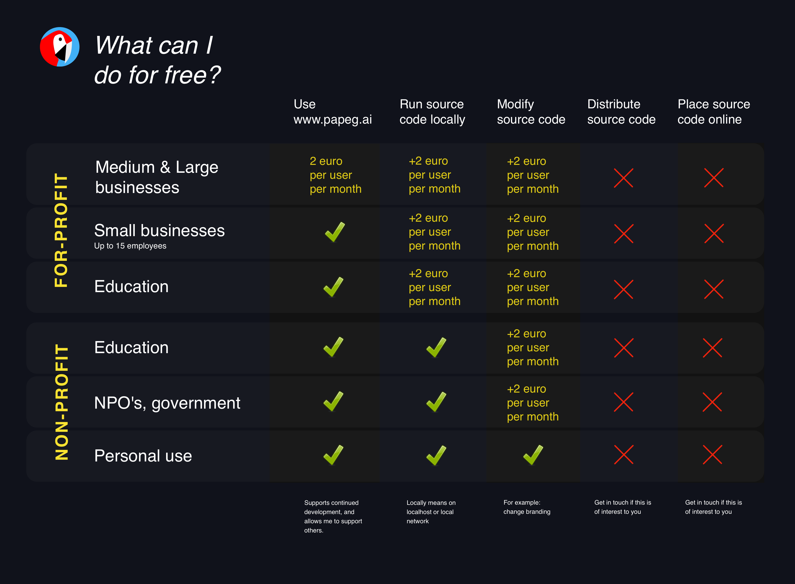

# Papeg.ai

This is the source code for Papeg.ai, a website that offers popular AI features such as chat and document editing, and makes them free, easy to use and completely private.

See the code in action here:
https://papeg.ai

## TRANSPARENCY
Papeg.ai runs completely client-side, which means you always have access to the complete source code as it's running inside your web browser. The code is placed here as a convenience, to make inspecting it as easy as possible. 

This project was developed by a self-taught digital artist from Amsterdam, not a professional development team. You should not rely on papeg.ai for anything serious or mission-critical.

## WEBSITE LICENSE

You may use the online version at https://papeg.ai (and the beta version at https://papegai.eu) freely in any situation. If you use it in a corporate context, then you are honour-bound to get in touch and help to financially support the project (and in turn allow me to support the projects and services that make papeg.ai possible). A monthly fee of 2 euro per user is suggested.

## SOURCE CODE LICENSE

If you want to use this source code, for example to create a local deployment on your own server, then there are more restrictions as details below.

This code is currently **not** available under an open source licence. You may not use or duplicate this code except under the following conditions:

- A. Small business may use www.papeg.ai, but they may not host the code provided here on their own devices or servers unless given permission to do so.
- B. You may use this code for individual non-profit personal use, or within a non-profit organisation (e.g. schools, universities, government). You may deploy it on the localhost on your own device, or make it available on a local network only. You may not place it online anywhere.
- C. In any other case you may use, copy, deploy or otherwise enagage with this code if given explicit written permission to do so by Tijmen Schep.

Use at your own risk. www.papeg.ai and this source are provided as-is.

Commercial use may also be restricted by the usage license of certain AI models (most notably the image generation AI's).

## COMMERCIAL USE

Get in touch with Tijmen Schep if you're interested in using papeg.ai and/or this code in a for-profit situation.

## INSTALLATION

You don't need to install this on your own device. Simply visit https://www.papeg.ai to use it.

But if you really want to:
- Download the latest release zip file, and unzip that to a folder.
- Open a terminal for that folder, and type `python3 -m http.server`, then press enter.
- Open a browser and surf to: `localhost:8000` (or, alternatively, `127.0.0.1:8000`). You may need to change the 8000 to 8080 or 5000.
